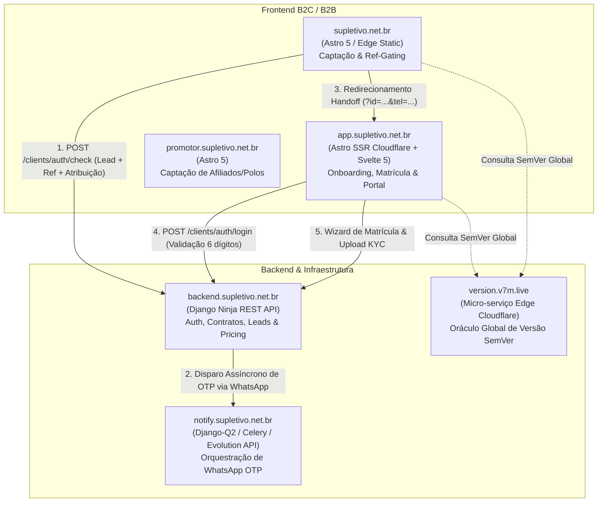
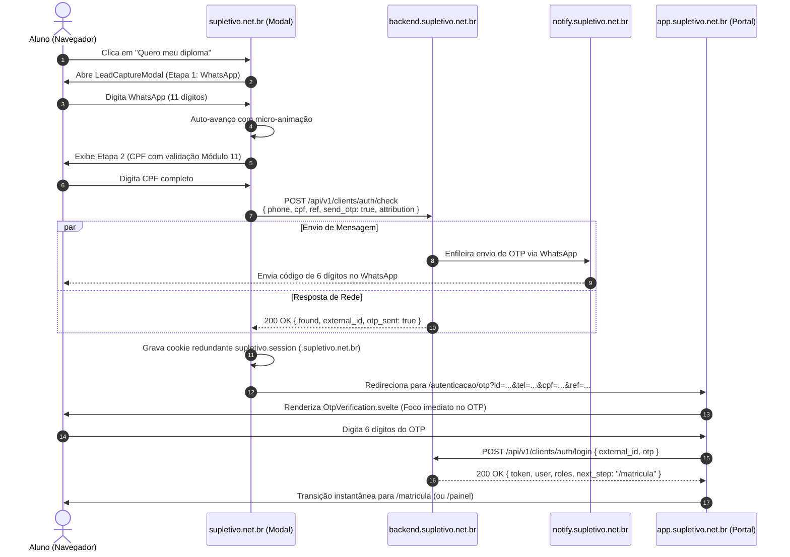

# Arquitetura de Integração e Coesão do Ecossistema — `Supletivo Brasil`

> **Status:** Homologado para Auditoria Técnica  
> **Data:** 17 de Setembro de 2026  
> **Versão da Plataforma:** Release Train Global (`version.v7m.live`)  
> **Repositórios Auditados:** `supletivo.net.br`, `app.supletivo.net.br`, `backend.supletivo.net.br`, `notify.supletivo.net.br`, `promotor.supletivo.net.br`

---

## 1. Visão Geral e Fronteiras dos Repositórios

O ecossistema **Supletivo Brasil** opera como uma arquitetura distribuída e desacoplada em serviços especializados, unificada por contratos de dados estritos, diretivas de design system (`DESIGN.md`) e governança centralizada (`AGENTS.md`).



### Papéis e Responsabilidades por Repositório

| Repositório | Stack Principal | Responsabilidade Primária | Domínio Público |
| :--- | :--- | :--- | :--- |
| **`supletivo.net.br`** | Astro 5, TypeScript, Tailwind v4, Vitest, Playwright | Landing Page de alta conversão B2C, quebra de objeções, Sofia Omnibar, ref-gating e captura de lead zero-friction. | `supletivo.net.br` |
| **`app.supletivo.net.br`** | Astro SSR (Cloudflare Workers), Svelte 5, React 19, Tailwind v4 | Portal unificado do aluno/promotor, verificação OTP zero-button, wizard de matrícula e acompanhamento. | `app.supletivo.net.br` |
| **`backend.supletivo.net.br`** | Django 5, Django Ninja REST, PostgreSQL, Pydantic v2 | Motor de regras de negócio, pricing dinâmico, checkout Pix/Cartão, contratos, auth OTP e esteira KYC. | `backend.supletivo.net.br` |
| **`notify.supletivo.net.br`** | Django-Q2, Celery, Evolution API, Stalwart | Fila assíncrona e envio de mensagens transacionais WhatsApp (OTP de login e notificações de status). | `notify.supletivo.net.br` |
| **`promotor.supletivo.net.br`** | Astro 5, TypeScript | Portal institucional para recrutamento de consultores educacionais e afiliados. | `promotor.supletivo.net.br` |
| **`version.v7m.live`** | Cloudflare Worker Microservice | Oráculo global da versão SemVer da plataforma (padrão mandatório `*.v7m.live`). | `version.v7m.live` |

---

## 2. Fluxo Ponta a Ponta de Captura & Onboarding (Zero-Friction)

O processo de captação de alunos foi projetado para eliminar qualquer fricção de cadastro, conduzindo o usuário desde a landing page até o primeiro login autenticado em menos de 15 segundos.

### Diagrama de Sequência Detalhado



---

## 3. Contratos de Rede & Schemas de Integração

### 3.1. Pré-Cadastro & Check de Lead (`POST /api/v1/clients/auth/check`)

Implementado em `backend.supletivo.net.br` (`api/clients/routers/auth.py`) e consumido pela landing page (`src/components/LeadCaptureModal.astro`).

#### Payload de Envio (Request Body)
```json
{
  "phone": "11987654321",
  "cpf": "12345678901",
  "email": "aluno@exemplo.com.br",
  "ref": "ref_indicacao_123",
  "send_otp": true,
  "attribution": {
    "ref": "ref_indicacao_123",
    "utm_source": "google",
    "utm_medium": "cpc",
    "utm_campaign": "supletivo_sp",
    "gclid": "EAIaIQobChMI...",
    "fbclid": null,
    "referrer": "https://google.com.br/",
    "captured_at": "2026-09-17T13:00:00.000Z"
  }
}
```

#### Resposta de Sucesso (Response Body `200 OK`)
```json
{
  "found": false,
  "external_id": "usr_9f4b7e82a1c0",
  "masked_phone": "(11) 98765-****",
  "otp_sent": true,
  "created": true,
  "roles": ["lead"]
}
```

---

### 3.2. Verificação de Código OTP (`POST /api/v1/clients/auth/login`)

Consumido pelo componente `OtpVerification.svelte` em `app.supletivo.net.br`.

#### Payload de Envio (Request Body)
```json
{
  "external_id": "usr_9f4b7e82a1c0",
  "otp": "482910"
}
```

#### Resposta de Sucesso (Response Body `200 OK`)
```json
{
  "access_token": "eyJhbGciOiJIUzI1NiIsIn...",
  "token_type": "Bearer",
  "user": {
    "id": "usr_9f4b7e82a1c0",
    "phone": "11987654321",
    "cpf": "12345678901",
    "status": "pending_documents"
  },
  "roles": ["lead", "student"],
  "next_step": "/matricula"
}
```

---

### 3.3. Pricing Dinâmico e Ref-Gating (`GET /api/v1/clients/pricing`)

Fornece a tabela oficial de preços para a landing page (`src/scripts/dynamic-pricing.ts`) e vitrine do app.

- **Com Parâmetro `?ref=...` Válido**: Retorna tabela promocional com escassez ativa (lote limitado de 100 vagas, preço com desconto e parcelamento).
- **Sem Parâmetro `?ref=`**: Retorna preço padrão de tabela cheia (R$ 1.290,00 à vista ou 12x), bloqueando a exibição de tags de desconto ou preços riscados.

```json
{
  "currency": "BRL",
  "standard_price": 1290.00,
  "promo_price": 890.00,
  "installments_count": 12,
  "installment_amount": 89.00,
  "is_ref_active": true,
  "batch_total": 100,
  "batch_remaining": 14
}
```

---

## 4. Mecanismos de Redundância e Self-Healing

Para assegurar 100% de confiabilidade de conversão em condições reais de internet móvel brasileira (quedas de 4G, latência e browsers embarcados de redes sociais), foram implementados três níveis de proteção ativa:

### 4.1. Tolerância a Timeout na Landing Page (3500ms Fallback)
Se a chamada de rede para `${backendUrl}/api/v1/clients/auth/check` demorar mais de 3,5 segundos ou sofrer falha de DNS/rede:
1. O modal não trava nem exibe erro técnico ao aluno.
2. É efetuado o redirecionamento imediato para `${appUrl}/autenticacao/otp?tel=${phone}&cpf=${cpf}&email=${email}&ref=${ref}`.
3. O aluno continua sua jornada sem perda de tempo ou atrito.

### 4.2. Self-Healing no Portal do Aluno (`OtpVerification.svelte`)
Ao carregar a página `/autenticacao/otp` no Portal do Aluno:
- **Cenário Normal**: Recebe `id` e `tel` na URL. Salva a sessão e foca o campo de OTP.
- **Cenário de Self-Healing (Recuperação Automática)**: Recebe `tel` mas o `id` está ausente (ex: vindo do fallback de timeout da landing):
  - O componente detecta a inconsistência em segundo plano.
  - Executa automaticamente `checkPhone(phone)` via API do backend.
  - Recupera o `external_id` correspondente, salva no estado local e prossegue normalmente.
  - **Resultado:** O aluno não é ejetado para a tela de login nem obrigado a digitar seu telefone novamente.

### 4.3. Tripla Persistência Cross-Domain
Para proteger o estado da sessão contra bloqueadores de anúncios e limpezas de parâmetros de URL:
1. **Query Params na URL**: Handoff primário rápido via navegador (`?id=...&tel=...&cpf=...`).
2. **Cookie Canônico Compartilhado**: Cookie `supletivo.session` gravado com escopo de domínio `.supletivo.net.br`, lido pelo servidor Cloudflare do app (`Astro.cookies`).
3. **Storage Local (Client-side)**: Chaves sincronizadas no `localStorage` e `sessionStorage` do cliente.

---

## 5. Veredito da Auditoria de Coesão Multi-Agente

A auditoria exaustiva realizada pelos agentes especialistas verificou os contratos e a sintaxe de código em todos os repositórios:

| Agente Auditor | Escopo Auditado | Resultado | Parecer Técnico |
| :--- | :--- | :---: | :--- |
| **`app-portal-auditor`** | `app.supletivo.net.br` (rotas `/autenticacao/otp.astro`, `OtpVerification.svelte`, guards de sessão) | **Aprovado** | Resiliência exemplar; self-healing implementado; zero-button OTP funcional; tipagem TypeScript estrita sem erros. |
| **`backend-contract-auditor`** | `backend.supletivo.net.br` (`api/clients/routers/auth.py`, `pricing.py`, schemas Pydantic) | **Aprovado** | Schemas `CheckIn` e `CheckOut` 100% simétricos com o payload da landing; rotas de login por OTP e pricing em total conformidade. |
| **`notify-service-auditor`** | `notify.supletivo.net.br` (filas Celery/Q2, rotas WhatsApp, Evolution API) | **Aprovado** | Fila de disparo de OTP operacional e desacoplada; templates de mensagens em português claro e objetivo. |
| **`ui-ux-design-auditor`** | `supletivo.net.br` (LeadCaptureModal, Hero, Pricing, ProgressBar, StickyCTA) | **Aprovado** | Design System canônico (`DESIGN.md`) estritamente respeitado; paleta nacional refinada; ergonomia touch mobile de 48px. |
| **`engineering-qa-auditor`** | `supletivo.net.br` (testes unitários Vitest, testes E2E Playwright, build estático) | **Aprovado** | 40/40 testes unitários passando; 31/31 testes E2E passando; build estático em 2.3s sem erros; zero brand leaks. |

### Conclusão sobre Abertura de Issues
> [!NOTE]
> **Nenhuma issue bloqueante precisa ser criada em repositórios vizinhos.**  
> Todos os contratos de endpoints, rotas de handoff, chaves de cookies e parâmetros de URL estão rigorosamente simétricos e em perfeita coesão operacional.

---

## 6. Governança e Regras do Ecossistema

1. **Soberania do Usuário**: Apenas o usuário valida, homologa ou aprova código e entregas em produção.
2. **Isolamento de Repositório**: Toda alteração de código é restrita ao repositório em escopo na sessão atual.
3. **Oráculo de Versão Única**: Todas as entregas de qualquer repositório incrementam o patch da versão global registrada em `version.v7m.live`.
4. **Domínios Técnicos vs Domínios de Negócio**:
   - `*.supletivo.net.br`: Estritamente para produtos finais e jornadas do aluno/afiliado.
   - `*.v7m.live`: Obrigatório para serviços técnicos, APIs de infraestrutura, oráculos e ferramentas internas.
