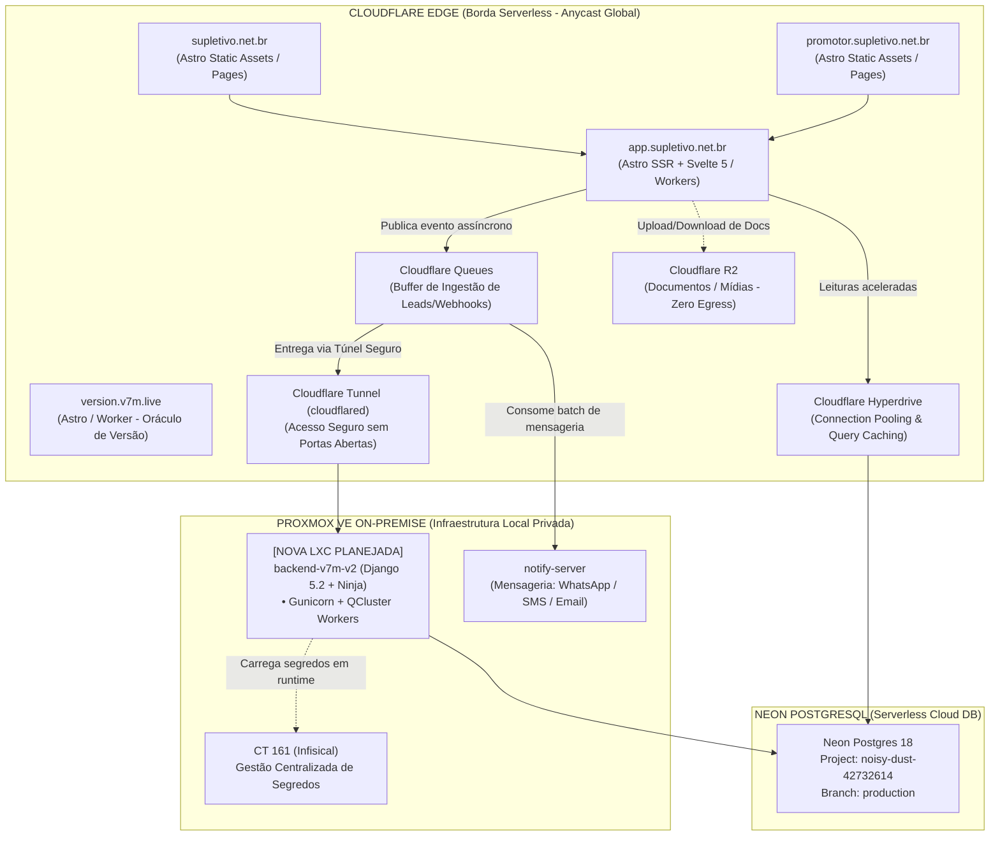

# Especificação Arquitetural de Infraestrutura, Topologia Híbrida e CI/CD

> **Status**: Proposta Arquitetural Submetida para Homologação do Usuário  
> **Data**: 2026-09-16  
> **Escopo**: Ecossistema Supletivo Brasil & Oráculo de Versão (`c:\rep`)  
> **Conformidade**: [`supletivo.net.br/AGENTS.md`](../AGENTS.md)

---

## 1. Visão Executiva e Topologia Híbrida

A infraestrutura do ecossistema é projetada sob o princípio mandatória **Cloudflare-First** para a camada de borda e interfaces, combinada com **Proxmox VE On-Premise** para serviços de persistência e computação intensiva.

---

## 2. Padrão Arquitetural: Assincronismo por Padrão (Async-First)

Toda função do backend e da plataforma segue o paradigma **assíncrono por padrão**, reservando execução síncrona exclusivamente para leituras imediatas de tela e autenticação.

### 2.1 Camadas de Filas
1. **Cloudflare Queues (Ingestão de Borda & Latência < 40ms)**:
   - Formulários de pré-cadastro e captura de lead.
   - Intenção de matrícula e cliques para WhatsApp.
   - Ingestão de webhooks financeiros (Asaas PIX e InfinitePay).
   - O cliente recebe resposta HTTP `202 Accepted` imediatamente; o processamento ocorre desacoplado.
2. **Cloudflare Queues ➔ Notify Server (`notify.supletivo.net.br`)**:
   - Consome da fila de borda para disparos imediatos de confirmação (WhatsApp via Z-API/Evolution, SMS e E-mail transacional).
3. **Django QCluster (Computação Pesada no Proxmox)**:
   - Processamento de biometria facial CPU (ArcFace InsightFace).
   - Extração de dados de documentos via OCR.
   - Geração de contratos, termos e certificados em PDF.
   - Conciliação bancária e split de comissões.

---

## 3. Matriz de Banco de Dados: Neon Postgres + Cloudflare Hyperdrive

* **Engine Principal**: **PostgreSQL 18** no **Neon** (`noisy-dust-42732614`).
* **Acelerador de Borda**: **Cloudflare Hyperdrive** configurado com a connection string do Neon, fornecendo pooling persistente e eliminação de sobrecarga de conexão para o `app.supletivo.net.br` e Workers.
* **Segredos**: Chaves e connection strings são recuperadas do **Infisical** (`http://10.0.1.61:8080`) sem nenhum arquivo `.env` comitado.

---

## 4. Matriz de Repositórios e Issues Criadas

Todas as decisões arquiteturais foram formalizadas em issues nos respectivos repositórios:

| Repositório | Papel | Hospedagem Alvo | Issue Aberta no GitHub |
| :--- | :--- | :--- | :--- |
| **`supletivo.net.br`** | Landing Page B2C | Cloudflare Pages / Static Assets | [#5 - Migrar pipeline para Cloudflare Pages e desacoplar de runner](https://github.com/maestri33/supletivo.net.br/issues/5) |
| **`promotor.supletivo.net.br`** | Landing Page B2B | Cloudflare Pages / Static Assets | [#4 - Migrar deploy para Cloudflare Pages e desacoplar de runner](https://github.com/maestri33/promotor.supletivo.net.br/issues/4) |
| **`app.supletivo.net.br`** | Portal Multi-Role | Cloudflare Workers SSR (`@astrojs/cloudflare` + Svelte 5) | [#5 - Migrar para @astrojs/cloudflare + Svelte 5 com Hyperdrive e Queues](https://github.com/maestri33/app.supletivo.net.br/issues/5) |
| **`backend.supletivo.net.br`** | Monólito Django Ninja | Nova LXC dedicada no Proxmox (pós-refatoração) | [#7 - Arquitetura async-first, Neon Postgres, Infisical e nova LXC](https://github.com/maestri33/backend.supletivo.net.br/issues/7) |
| **`notify.supletivo.net.br`** | Notifier Transacional | Proxmox / Consumidor Cloudflare Queues | [#3 - Consumo assíncrono de Queues, Infisical e CI/CD](https://github.com/maestri33/notify.supletivo.net.br/issues/3) |
| **`version.v7m.live`** | Oráculo de Versão Global | Cloudflare Worker nativo | [#2 - Endpoint de webhook de bump e release train integrado](https://github.com/maestri33/version.v7m.live/issues/2) |

---

## 5. Engenharia de CI/CD & Quality Gates

### 5.1 Quality Gates por Push / Pull Request
1. **Frontends Astro (`supletivo`, `promotor`)**:
   - `pnpm install --frozen-lockfile`
   - `pnpm run build`
   - `pnpm test` (vitest)
   - Playwright E2E + Axe (A11y)
   - Lighthouse CI (orçamento de performance)
2. **App Central (`app.supletivo.net.br`)**:
   - `astro check` + `tsc --noEmit`
   - Testes de componentes Svelte 5 e rotas multi-role com Playwright
   - Verificação de proveniência (`/healthz` conferindo o Git SHA)
3. **Backend (`backend.supletivo.net.br`)**:
   - `manage.py check`
   - `makemigrations --check --dry-run` (zero migrações esquecidas)
   - Pytest suite completa (280+ testes)
   - Validação de integridade do OpenAPI Schema JSON

### 5.2 Release Train & Oráculo Central
A cada deploy realizado com sucesso na branch `main` de qualquer um dos repositórios:
1. O workflow aciona o Oráculo Central em `https://version.v7m.live/api/version/bump`.
2. O patch global é incrementado e registrado com metadados do deploy (repo, commit SHA, data/hora).
3. O oráculo reflete publicamente a versão ativa em `https://version.v7m.live/api/version`.
